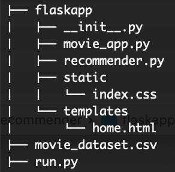

# Description

A movie recommendation engine using content based filtering. Similar movies was found using cosine similarity.

Movie dataset contains 4800+ records with multiple fields. Select features are `["keywords", "cast", "genres", "director"]`

Project structure:



# Set up

Use `pip install` to get required packages:

`pip install flask numpy pandas scikit-learn`


# Run

```
$ export FLASK_APP=run.py
```

```
$ flask run
```

By default, service will be running on `http://127.0.0.1:5000/`


# UI


