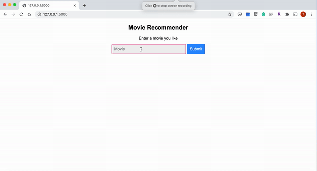

# Description

A movie recommendation engine using content-based filtering. UI for this application is a website which ouputs similar movies from user input. There is a drop-down menu from the search bar to show which movies exists in the dataset.

Movie dataset contains 4800+ movie records in a single csv file. Selected features to calculate similarities are `["keywords", "cast", "genres", "director"]`

Cosine similarity is used to calculate output. Similarity scores are computed on the fly upon user input.

Project structure:

```
├── flaskapp
│   ├── __init__.py
│   ├── movie_app.py
│   ├── recommender.py
│   ├── static
│   │   └── main.css
│   └── templates
│       └── home.html
├── movie_dataset.csv
├── run.py
```

# Set up

Use `pip install` to get required packages:

`pip install flask numpy pandas scikit-learn`


# Run

```
$ export FLASK_APP=run.py
```

```
$ flask run
```

By default, service will be running on `http://127.0.0.1:5000/`


# Demo


